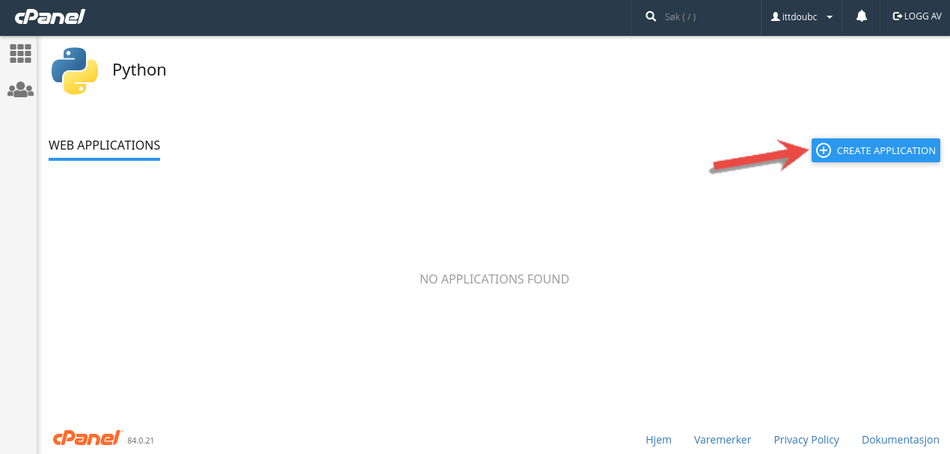
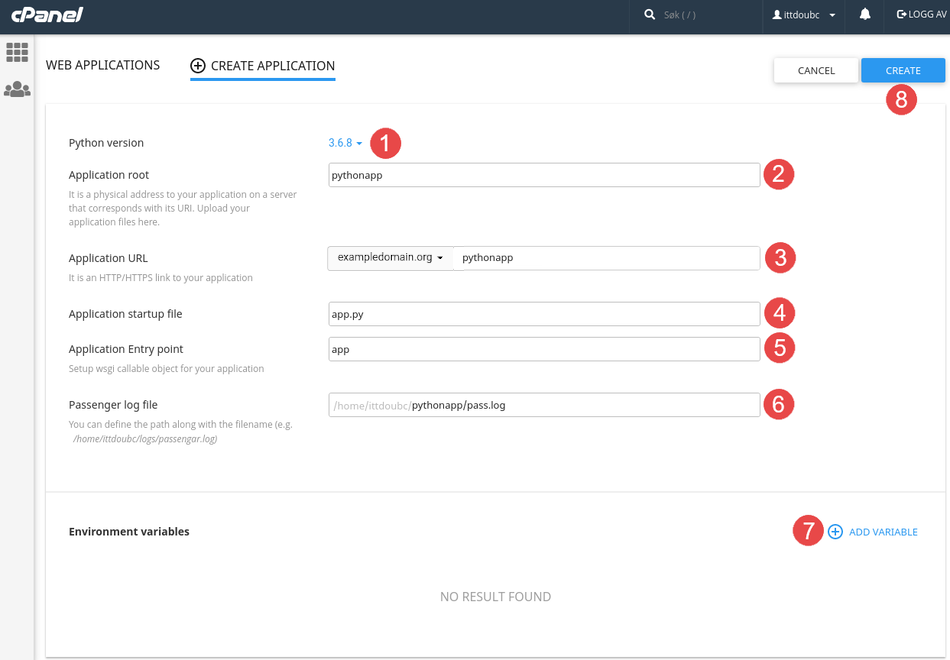
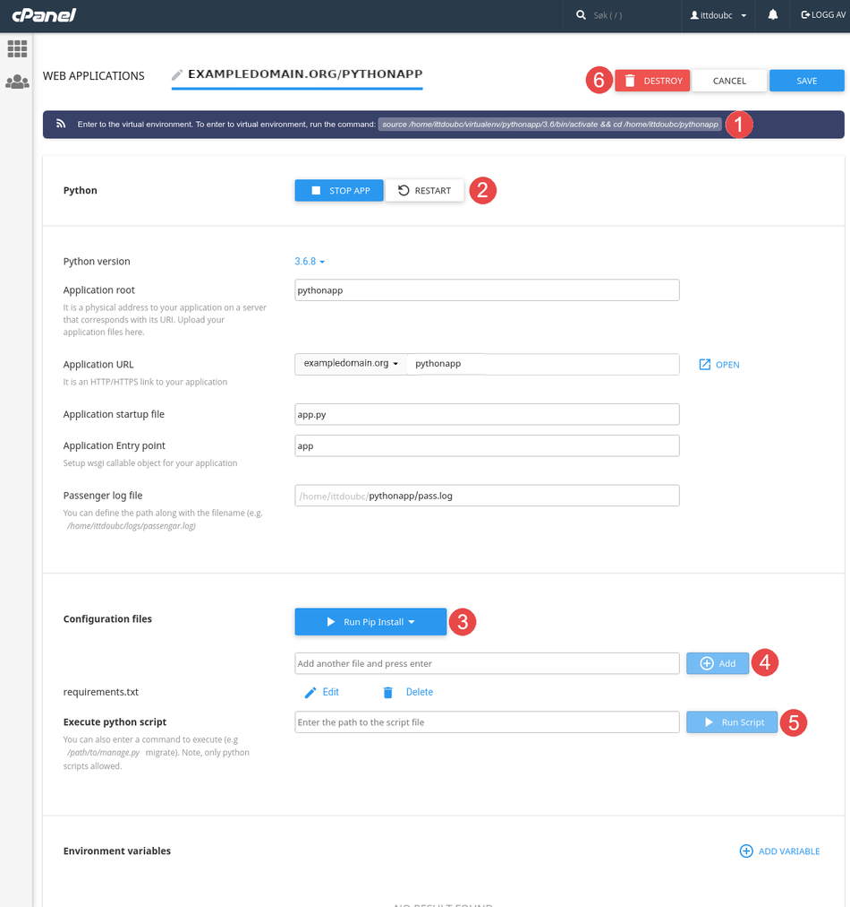

## [Tutorial]How to deploy Python Flask App on shared cpanel hosting

**Step 1:**

- Click the "Setup Python App" icon.

**Step 2:**

- Press the "Create Application" button.

**Step 3:**

Options:
    a. Python version - pick the latest Python 3 if you are unsure
    b. Application root - Path relative to your home directory. You can provide full path like /home/nanodano/mypyapp but it will replace it with mypyapp
    c. Application URL - Choose the domain name and URL to use. Leave blank or enter / to use the root of the domain. Note if you are using the default domain that points to public_html/ and you have an index.html file, that index file will take precedence for the root / URL.
    d. Application startup file - e.g. app.py, the file that contains the WSGI application (Examples below). It will create a default file with some boilerplate to demonstrate it works so you do not have to provide a file before-hand.
    e. Application Entry point - The name of the function/object that WSGI should load. e.g. app. Examples below, but it will automatically generate an example using your value.
    f. Passenger log file - Path to store log entries
    g. Environment variables - Any environment variables the app needs

    - Choose the python version you wish to use.
    - Enter the directory that the python application should be installed to. This is path is relative to the root directory of the web hotel and will create the specified directory if it does not exist.
    - Enter the address the application should be located on. If it should accessible directly on your domain, leave the field blank.
    - Enter the name of the file to run. This must link "Application Entry Point" (see point 5) with the application itself.
    - For example, assuming that this example runs a Flask server, this can be done by defining "app = Flask (__ name__)" in the specified file.
    - Enter the name of the variable containing the server.
    - This is the path to where the Phusion Passenger log file is written.
    - Here environment variables can be added for python installation if needed.
    - When all fields are filled in as desired, press the "Create" button to set up the application.

**Step 4:**

You can now make changes and manage the python application.

    - This is the command you input in the terminal to enter the virtual environment that is set up for the application. To install packages through pip, this command must be run first.
    - These buttons allow you to start, stop and restart the application.
    - If you have added a configuration file (ref. Point 4), for example a "requirements.txt" made with pip, you can install the listed packages by pressing this button.
    - Here you can add configuration files for the python application.
    - Here you can run python script located on the webhosting. This is useful if you do not have access to the terminal and want to run python script to do setup, for example to create a super user in Django. The script is run in the virtual environment of the application.
    - These buttons allow you to save or discard changes as well as delete the entire application.

Finished
We have now gone through how to create a Python application, as well as how to manage, update the environment and delete it.